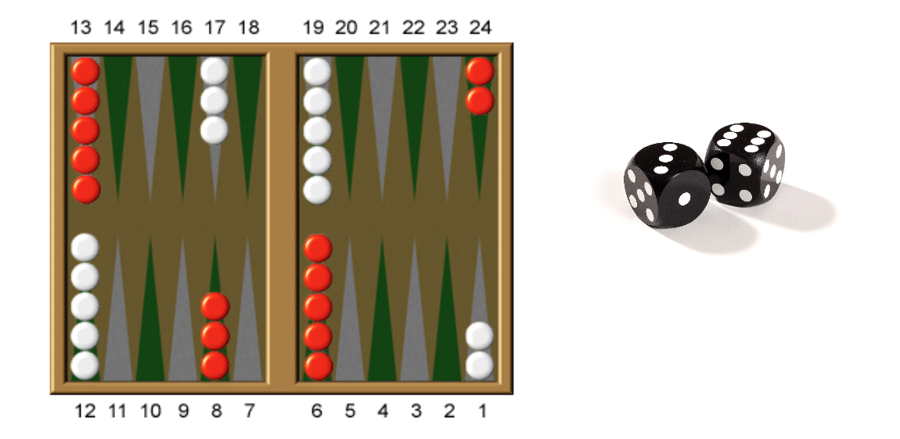

# 01 Exercise: Backgammon Object Oriented Analysis
> Exercise, day 1 (design)

1. This exercise should be done in groups of 2-3 persons.    

2. Identify which objects the image below contains. Use the same approach as we just did with the Angry Bird Game.    

**Try to identify:**    
1. attributes (something that describes what the object is or has)
2. actions (what the object can do)

You will get 15 minutes to complete this exercise.     
Afterwards we look at it together at the black board.    

© Kea, clbo,  04-02-2015

